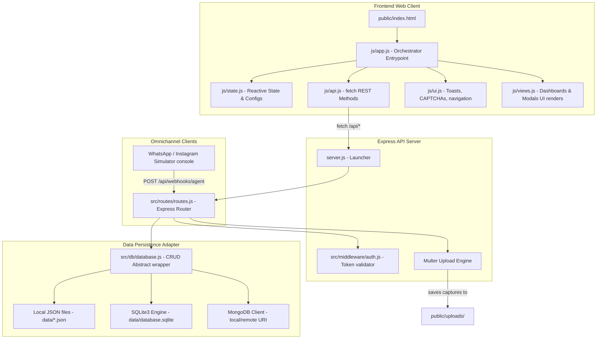
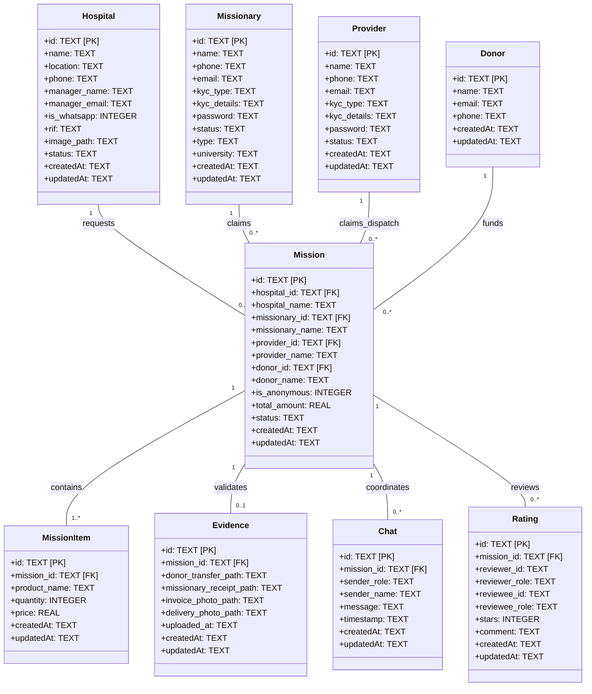
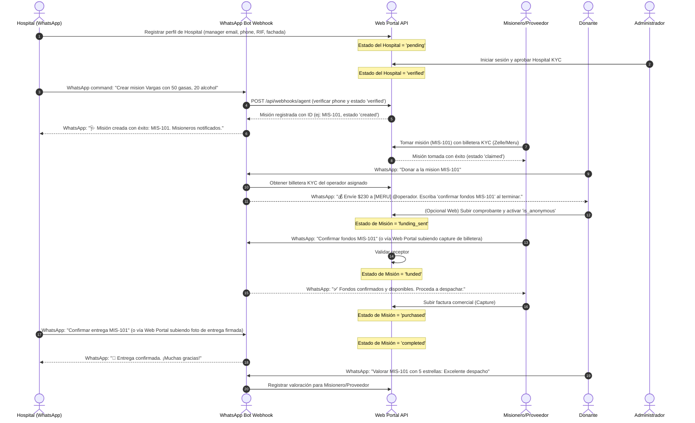

# CUMIS Conecta 🩺

> Plataforma modular de alta velocidad e impacto humanitario para Mérida y Venezuela.

**CUMIS Conecta** es una plataforma cerrada (closed-loop marketplace) que vincula de manera directa a centros de salud (hospitales), misioneros logísticos de campo (estudiantes de medicina y sociedad civil), proveedores locales de insumos médicos y donantes internacionales para agilizar el suministro de medicamentos y materiales quirúrgicos esenciales.

---

## 🚀 Características Clave

1. **Gestión de Misiones Humanitarias**: Los hospitales cargan carritos de insumos médicos de primera necesidad.
2. **Operadores KYC (Misioneros y Proveedores)**:
   - **Misioneros**: Clasificados en *Estudiantes* (afiliación universitaria requerida) o *Sociedad Civil*.
   - **Proveedores**: Mayoristas comerciales que pueden reclamar misiones como **Donación Directa** (evitando la fase de recaudación).
3. **Donaciones Seguras y Anónimas**:
   - Soporte para marcar donaciones como anónimas (oculta el nombre en listados públicos).
   - **Aislamiento Seguro de Comprobantes**: Las capturas de pantalla de transferencias y billeteras digitales solo son visibles para el Administrador de auditoría o los operadores directamente vinculados a esa misión.
4. **Seguridad Anti-Bots**: CAPTCHA matemático dinámico en todos los registros para garantizar operaciones auténticas y humanas.
5. **Priorización Inteligente**: Listados de misiones ordenados por reputación (promedio de valoración de estrellas) de los hospitales solicitantes.

---

## 🗺️ Estructura del Repositorio

La solución sigue un diseño limpio y modular bajo las guías del skill **Ponytail**:

```text
├── CONVERSATION_CONTEXT.md          # Bitácora e historial de la conversación
├── README.md                       # Documentación principal del proyecto
├── server.js                        # Lanzador minimalista del servidor Express
├── package.json                     # Definición de dependencias
├── docs/                            # Archivos de diagramas en Mermaid
│   ├── uml.mermaid                  # Diagrama de Clases
│   ├── sequence.mermaid             # Diagrama de Secuencia E2E
│   └── architecture.mermaid         # Diagrama de Arquitectura
├── data/                            # Almacenamiento local
│   ├── database.sqlite              # Base de datos SQLite local
│   └── conversation_context.json    # Copia estructurada del contexto
├── public/                          # Archivos estáticos del frontend
│   ├── index.html                   # HTML del portal único
│   ├── uploads/                     # Carpeta de carga de captures (Multer)
│   └── js/                          # Módulos del Frontend (ES Modules)
│       ├── app.js                   # Orquestador y bindings globales a window
│       ├── state.js                 # Estado central reactivo
│       ├── api.js                   # Cliente HTTP REST
│       ├── ui.js                    # Utilidades DOM, Toasts y CAPTCHAs
│       └── views.js                 # Render de dashboards y modales
├── scripts/                         # Scripts de validación
│   └── e2e-verify.js                # Suite de pruebas de integración E2E
└── src/                             # Lógica del Servidor
    ├── db/
    │   └── database.js              # Adaptador CRUD (JSON/SQLite/MongoDB)
    ├── middleware/
    │   └── auth.js                  # Manejo de roles y autenticación
    └── routes/
        └── routes.js                # Endpoints REST y Webhooks de WhatsApp
```

---

## 🛠️ Configuración e Instalación

### Requisitos Previos
- **Node.js** v18 o superior.
- (Opcional) **MongoDB** si se desea utilizar base de datos documental.

### 1. Variables de Entorno
Crea un archivo `.env` en la raíz del proyecto:
```env
PORT=3000
DB_TYPE=sqlite                     # Opciones: 'json', 'sqlite', 'mongodb'
MONGODB_URI=mongodb://localhost:27017/cumis_conecta  # Requerido si DB_TYPE = 'mongodb'
ADMIN_PASSCODE=manu2026             # Clave para ingresar a la consola de administración
```

### 2. Instalación de Dependencias
```bash
npm install
```

### 3. Iniciar el Servidor
```bash
npm start
```
El servidor se levantará en [http://localhost:3000](http://localhost:3000).

---

## 🧪 Pruebas de Integración E2E

Para ejecutar la suite automatizada que valida todos los flujos de creación, fondeo, KYC y validación de entregas:
```bash
node scripts/e2e-verify.js
```

---

## 📊 Diagramas de Sistema

### 1. Diagrama de Arquitectura Modular


### 2. Modelo de Clases UML (Datos)


### 3. Diagrama de Secuencias E2E (Mensajería y Logística)

