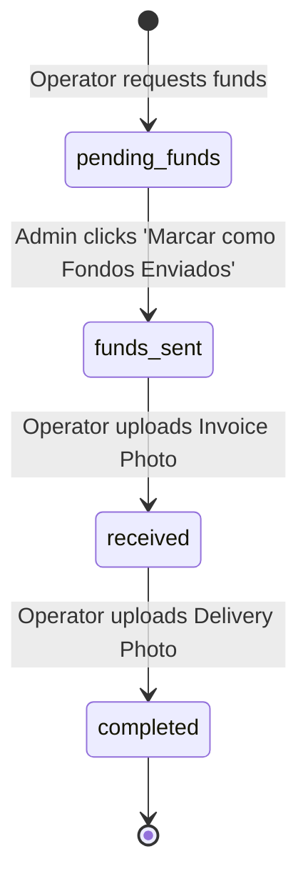

# Data Model Specification: CUMIS Conecta

This specification defines the persisted state schemas and states of the system.

## Database Entities

### 1. `operators`
Represents the logistics personnel in the field.
* `id`: string (UUID or autoincrement ID)
* `name`: string
* `phone`: string (unique lookup for login)
* `zelle_email`: string
* `password`: string (hashed/encrypted or simple string for speed)
* `status`: `'pending'` | `'verified'`

### 2. `products`
The medical supplies available in the market. Must strictly belong to the catalog list of 29 items.
* `id`: string
* `name`: string (one of the 29 catalog items)
* `supplier_name`: string
* `price`: number (USD referential price)
* `stock`: number

### 3. `orders`
The procurement missions accepted by operators.
* `id`: string
* `operator_id`: string
* `supplier_name`: string
* `total_amount`: number
* `status`: `'pending_funds'` | `'funds_sent'` | `'received'` | `'completed'`
* `created_at`: timestamp

### 4. `order_items`
Details of products inside each order.
* `id`: string
* `order_id`: string
* `product_name`: string
* `quantity`: number
* `price`: number

### 5. `disbursements`
Zelle transfer requests associated with orders.
* `id`: string
* `order_id`: string
* `operator_id`: string
* `amount`: number
* `status`: `'requested'` | `'sent'`
* `receipt_path`: string (optional, file path of local upload capture)
* `updated_at`: timestamp

### 6. `chats`
Interactive coordination feed between operators and admin.
* `id`: string
* `order_id`: string
* `sender_role`: `'operator'` | `'admin'` | `'system'`
* `sender_name`: string
* `message`: string
* `timestamp`: timestamp

### 7. `donations`
Logged donor contributions.
* `id`: string
* `amount`: number
* `donor_name`: string
* `date`: string (ISO date)

### 8. `evidences`
Invoice and delivery confirmation uploads.
* `id`: string
* `order_id`: string
* `invoice_photo_path`: string
* `delivery_photo_path`: string
* `uploaded_at`: timestamp

---

## State Transition Rules

### Order Status Machine

### Business Rules
1. **Disbursement Limit**: An order can only have one active disbursement request.
2. **Dashboard Math**:
   - `Donation Income` = Sum of all `donations.amount`.
   - `Funds in Transit` = Sum of all `orders.total_amount` where status is `'funds_sent'`.
   - `Legalised Expenses` = Sum of all `orders.total_amount` where status is `'received'` or `'completed'`.
