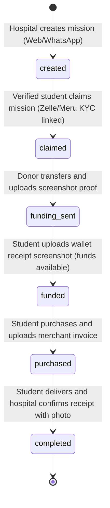

# Data Model Specification: CUMIS Conecta (Hospital & Student Pivot)

This specification defines the database tables and state machine for the CUMIS Conecta platform.

## Database Entities

### 1. `hospitals`
Represents the requesting health centers.
* `id`: string (UUID)
* `name`: string
* `location`: string
* `phone`: string (identifier for WhatsApp webhook parsing)

### 2. `students`
Represents the logistics student operators completing the field missions.
* `id`: string (UUID)
* `name`: string
* `phone`: string
* `email`: string
* `kyc_type`: `'zelle'` | `'meru'`
* `kyc_details`: string (Zelle email or Meru handler account)
* `password`: string
* `status`: `'pending'` | `'verified'`

### 3. `donors`
International individuals or entities funding missions.
* `id`: string (UUID)
* `name`: string
* `email`: string
* `phone`: string

### 4. `missions`
Critical medical supply request tracking.
* `id`: string (friendly ID like `MIS-101`)
* `hospital_id`: string
* `hospital_name`: string
* `student_id`: string (nullable)
* `student_name`: string (nullable)
* `provider_id`: string (nullable)
* `provider_name`: string (nullable)
* `donor_id`: string (nullable until funded)
* `donor_name`: string (nullable)
* `total_amount`: number
* `status`: `'created'` | `'claimed'` | `'funding_sent'` | `'funded'` | `'purchased'` | `'completed'`
* `createdAt`: timestamp
* `updatedAt`: timestamp

### 5. `mission_items`
Detailed products requested in a specific mission.
* `id`: string (UUID)
* `mission_id`: string
* `product_name`: string
* `quantity`: number
* `price`: number (USD referential cost)

### 6. `chats`
Message feed context for both the Web detail modal and simulated omnichannel agent integrations.
* `id`: string (UUID)
* `mission_id`: string
* `sender_role`: `'hospital'` | `'student'` | `'provider'` | `'donor'` | `'admin'` | `'system'`
* `sender_name`: string
* `message`: string
* `timestamp`: timestamp

### 7. `evidences`
Invoice and delivery proof files uploaded by students, providers, and health officials.
* `id`: string (UUID)
* `mission_id`: string
* `donor_transfer_path`: string (screenshot of donor Zelle/Meru transfer)
* `student_receipt_path`: string (screenshot of student or provider wallet balance confirming receipt)
* `invoice_photo_path`: string (merchant bill capture)
* `delivery_photo_path`: string (hospital delivery confirmation capture)
* `uploaded_at`: timestamp

### 8. `providers` [NEW]
Wholesalers or drugstores registered on the platform.
* `id`: string (UUID)
* `name`: string
* `phone`: string
* `email`: string
* `kyc_type`: `'zelle'` | `'meru'`
* `kyc_details`: string
* `password`: string
* `status`: `'pending'` | `'verified'`
* `createdAt`: timestamp

### 9. `ratings` [NEW]
Feedback reviews left by participants.
* `id`: string (UUID)
* `mission_id`: string
* `reviewer_id`: string
* `reviewer_role`: `'student'` | `'provider'` | `'donor'` | `'hospital'`
* `reviewee_id`: string
* `reviewee_role`: `'student'` | `'provider'` | `'donor'` | `'hospital'`
* `stars`: number (1-5)
* `comment`: string
* `createdAt`: timestamp

---

## State Transition Rules

### Mission Status Machine

### Dashboard Calculations
- **Donation Income**: Sum of all `missions.total_amount` where status is `funding_sent`, `funded`, `purchased`, or `completed`.
- **Funds in Transit**: Sum of all `missions.total_amount` where status is `funding_sent`, `funded`, or `purchased`.
- **Gastos Legalizados (Impact)**: Sum of all `missions.total_amount` where status is `completed`.
